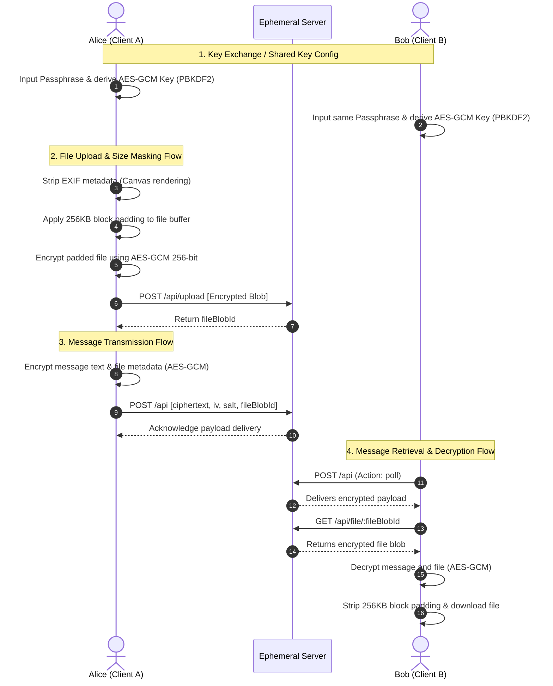

# ☣️ XTASSY: Ephemeral E2EE Terminal Chat Platform

```
██╗  ██╗████████╗ █████╗ ███████╗███████╗██╗   ██╗
╚██╗██╔╝╚══██╔══╝██╔══██╗██╔════╝██╔════╝╚██╗ ██╔╝
 ╚███╔╝    ██║   ███████║███████╗███████╗ ╚████╔╝ 
 ██╔██╗    ██║   ██╔══██║╚════██║╚════██║  ╚██╔╝  
██╔╝ ██╗   ██║   ██║  ██║███████║███████║   ██║   
╚═╝  ╚═╝   ╚═╝   ╚═╝  ╚═╝╚══════╝╚══════╝   ╚═╝   
              secure-node-tty0 v3.0.0
```

**Xtassy** is a privacy-first, zero-footprint, end-to-end encrypted (E2EE) messaging monorepo. It features a retro-futuristic, high-contrast, cyberpunk CRT terminal-style UI designed around strict ephemeral security principles. No sensitive data is ever written to disk on the server side, and all client communications are cryptographically shielded directly in the browser using the **Web Crypto API**.

---

## 🛰️ Core System Features

### 1. Cryptographic Isolation (E2EE)
*   **AES-GCM 256-bit Encryption**: All message text and file attachments are encrypted and decrypted in the user's browser. The server only sees encrypted blobs, initialization vectors (IVs), and salts.
*   **PBKDF2 Key Derivation**: High-entropy symmetric session keys are derived client-side from a shared room passphrase using 100,000 PBKDF2 iterations with HMAC-SHA256.

### 2. Side-Channel & Traffic Analysis Mitigations
*   **Cryptographic Size Masking**: Files are padded to the nearest **256KB block** before encryption to prevent passive eavesdroppers from identifying uploaded files by analyzing exact file sizes.
*   **Metadata Scrubbing**: Integrated offscreen HTML5 Canvas pipeline automatically strips EXIF data (location, camera specs, timestamps) from image uploads before encryption.
*   **Filename Masking**: Original filenames are discarded client-side and replaced with random generic handles (e.g., `generic_attachment_x9f2a7d1.png`) before transmission.

### 3. Ephemeral Serverless/Local Backend
*   **Zero-Disk Footprint**: In local dev mode, the Node/Express backend (`backend/server.js`) stores all sessions, files, and messages entirely in volatile heap memory. A server restart or admin panic command purges all data instantly.
*   **Stateless Serverless Adapter**: Built-in support for serverless platforms (like Netlify functions) using **Upstash Redis** as a volatile storage layer with strict TTL policies (24-hour max lifespans) to respect the zero-disk mandate.
*   **Enforced Burn Policies**: A background cleaner sweeps active channels every 1.5 seconds, burning messages on timer expiration, read confirmation (`burn-on-read`), or recipient logout (`burn-on-close`).

### 4. Privilege Clearance Escalation (Local Proof-of-Work)
*   **Ring Privilege Model**: Users start at **Ring 3 (default)** and can escalate up to **Ring 0 (sysop)**.
*   **Hashcash PoW Puzzle**: Browser-based mining engines solve SHA-256 block puzzles starting with multiple leading zeros to unlock higher Rings.
*   **Escalation Auditing**: Upgrades require minimum thresholds of chat activity (messages sent, key rotations, session uptime).

### 5. Multi-Theme Visual Aesthetics
*   Phosphor Amber, Cyberpunk Poison (Green/Pink), Deep Space Nebula (Purple), and Monochrome Silver.
*   Authentic CRT screen overlay, retro scanlines, monospaced typography, and responsive cyberpunk glass panels.

---

## 📂 Repository Layout

```
xtassy/
├── backend/                  # Local Express server engine
│   ├── database.js           # Ephemeral in-memory database & cleanup cycles
│   ├── server.js             # HTTP Dispatcher & Multer upload APIs
│   └── package.json
├── frontend/                 # React + TypeScript client application
│   ├── src/
│   │   ├── components/       # ChatWindow, Dashboard, AdminConsole, etc.
│   │   ├── crypto.ts         # PBKDF2/AES-GCM & Proof-of-Work miners
│   │   ├── index.css         # Styling system & custom themes
│   │   └── App.tsx           # Global state orchestrator
│   └── package.json
├── netlify/                  # Serverless function deployment
│   └── functions/
│       └── api.js            # Serverless entry point backing Upstash Redis
├── netlify.toml              # Netlify routes and build config
└── package.json              # Monorepo task runner
```

---

## 🛠️ Installation & Setup

### Local Monorepo Dev Environment

1.  **Clone the Repository**:
    ```bash
    git clone https://github.com/Harsha-Sidd/xtassy.git
    cd xtassy
    ```

2.  **Bootstrap Dependencies**:
    Install all required packages for root, frontend, and backend packages concurrently:
    ```bash
    npm run install:all
    ```

3.  **Start Local Development**:
    Launch the backend (port 5000) and frontend (Vite dev server) side-by-side:
    ```bash
    npm run dev
    ```

4.  **Access the Dashboard**:
    Open [http://localhost:5173](http://localhost:5173) in your browser.

---

## 🛡️ Cryptographic Flow Mechanics



### Symmetric Key Setup & Validation
The client derives its encryption key via `crypto.subtle.deriveKey`. Passphrase entropy is rated client-side prior to derivation to ensure strong protection against brute-force attacks:
*   **Low Entropy**: Short length or single character set.
*   **Medium Entropy**: Complex with varied character types.
*   **High Entropy**: $\ge$ 12 characters combining uppercase, lowercase, numbers, and special symbols.

---

## ⚡ Ring Clearance Proof-of-Work (PoW)

Xtassy uses a local client-side Hashcash implementation to control access rings. This limits abuse and rate-limits connections programmatically.
```
Hash = SHA256(username + "_ring" + targetRing + "_" + nonce)
```

The client increments the $\text{nonce}$ until the resulting Hex string starts with the designated difficulty threshold:

| Ring Level | Title | Difficulty (Leading Zeros) | Target Role |
| :--- | :--- | :--- | :--- |
| **Ring 3** | Guest | 0 | Standard user |
| **Ring 2** | Operator | 4 zeros | Access to advanced logs |
| **Ring 1** | Kernel | 5 zeros | Access to network stats |
| **Ring 0** | SysOp | 6 zeros | Full console metrics |

---

## 💻 Administration Console

Users elevated to administrative rights (by providing the `ADMIN_TOKEN`) gain access to real-time telemetry and channel moderation controls:

### Supported Actions
*   **HTOP Telemetry**: Monitor Node.js heap usage (`process.memoryUsage()`) and runtime server uptime.
*   **User Ban/Kick**: Evict target usernames. Evicted sessions are terminated instantly during active polling cycles.
*   **Broadcast Alert**: Push a system-wide broadcast message to all users in `#global` (configured to auto-burn in 60s).
*   **Targeted Nuke**: Wipe all messages and files associated with a specific room immediately.
*   **Panic Nuke**: A quick-trigger wipe command that flushes every table in the server's volatile memory.

---

## 🌐 Serverless Deployment (Netlify + Upstash)

To deploy the stack to Netlify serverless functions:

1.  **Configure environment variables** in Netlify dashboard:
    *   `ADMIN_TOKEN`: Master secret string for administrative console verification.
    *   `UPSTASH_REDIS_REST_URL`: Upstash REST database URL endpoint.
    *   `UPSTASH_REDIS_REST_TOKEN`: Upstash database authorization token.
2.  Deploy via Netlify CLI or connect your GitHub repository. Netlify builds the Vite frontend and serves the endpoints via `/api` (mapped to `netlify/functions/api.js` in `netlify.toml`).

---

## ⚠️ Security Disclaimer
Xtassy is built for ephemeral messaging, demonstration, and privacy experiments. Because it stores data client-side in browser state and utilizes polling protocols, always follow safe key-exchange standards (e.g. sharing your room passphrase through a secure out-of-band channel).
